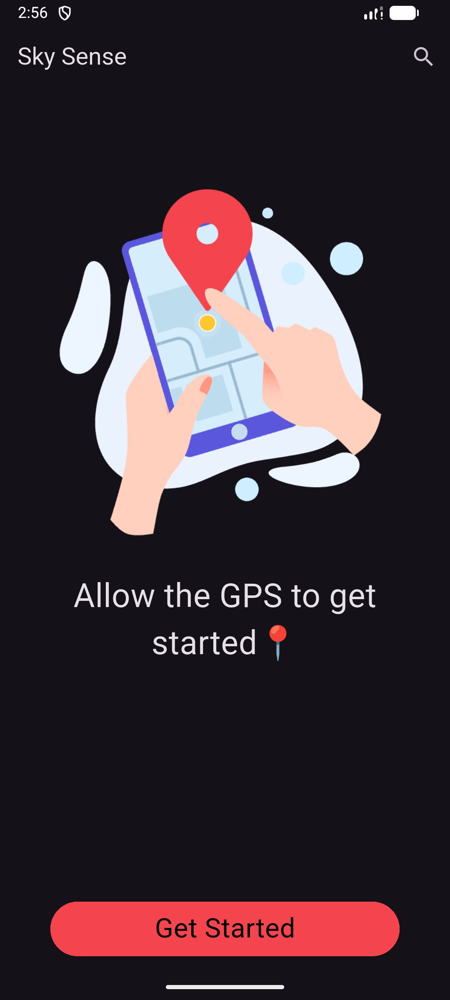
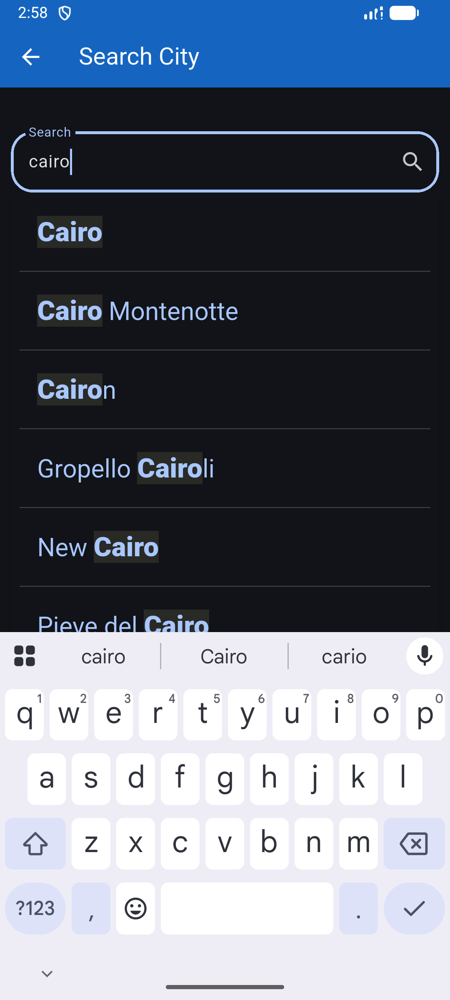
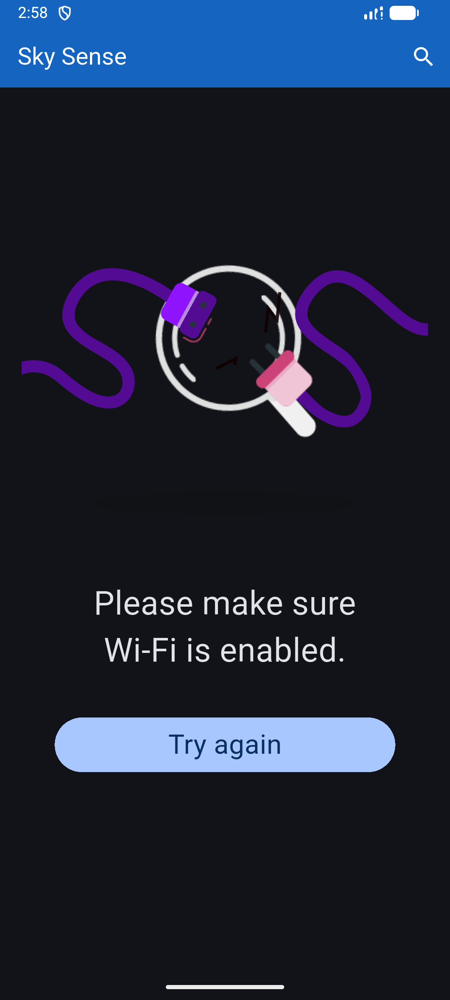
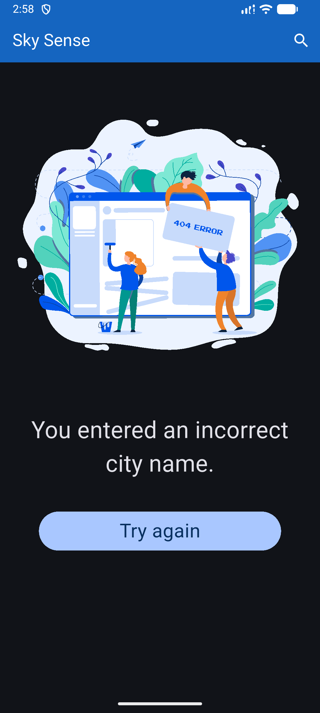
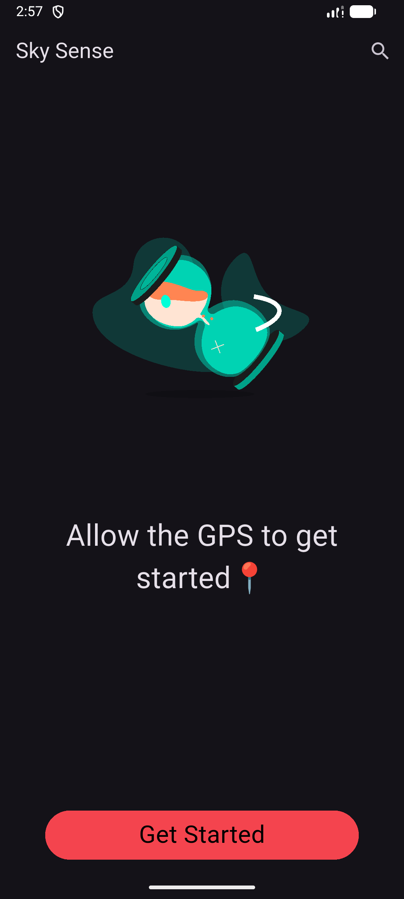
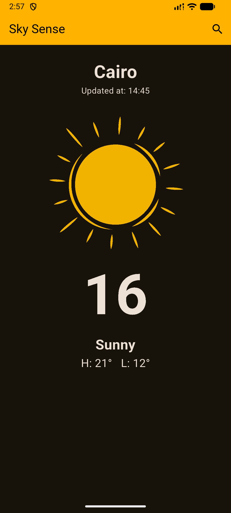

# 🌤️ Sky Sense

Sky Sense is a Flutter weather application that allows users to check real-time weather conditions by using GPS location or searching for a city by name.
The app includes an autocomplete search feature, dynamic themes that change based on weather conditions, and engaging Lottie animations.
It also handles no-internet and error states gracefully, providing a smooth and user-friendly experience across all devices.

---

# 🤖 Download the Android app here.
[Donwload now](https://ahmedeltantawi.netlify.app/Sky%20Sence.apk)

---

## 📱 Demo 🎬


https://github.com/user-attachments/assets/89fd7d09-748a-475d-80a0-054bb7bfba5a


<!-- Add your demo video here -->
<!-- Example:  -->


---

## 📸 Screenshots

<table>
  <tr>
    <th>Home Screen</th>
    <th>Search Screen</th>
  </tr>
  <tr>
    <td>
      <!-- Add your home screen screenshot here -->
      
    </td>
    <td>
      <!-- Add your search screen screenshot here -->
      
    </td>
  </tr>
  <tr>
    <th>No Internet Screen</th>
    <th>Error Screen</th>
  </tr>
  <tr>
    <td>
      <!-- Add your no internet screen screenshot here -->
      
    </td>
    <td>
      <!-- Add your error screen screenshot here -->
      
    </td>
  </tr>
  <tr>
    <th>Waiting Screen</th>
    <th>Weather Info Screen</th>
  </tr>
  <tr>
    <td>
      <!-- Add your waiting screen screenshot here -->
      
    </td>
    <td>
      <!-- Add your weather info screen screenshot here -->
      
    </td>
  </tr>
</table>

---

## ✨ Features

- 📍 **GPS Location Detection** - Automatically detects your current location to show local weather
- 🔍 **City Search with Autocomplete** - Search for any city with smart autocomplete suggestions from 50,000+ cities
- 🎨 **Dynamic Theming** - App theme dynamically changes based on current weather conditions (sunny, rainy, cloudy, etc.)
- 🎬 **Lottie Animations** - Beautiful animated weather icons for all weather conditions
- 🌡️ **Real-time Weather Data** - Get current temperature, high/low temperatures, and weather conditions
- 📱 **Responsive Design** - Clean and modern UI that works on all screen sizes
- 🌐 **Internet Connectivity Check** - Graceful handling of no internet connection
- ⚠️ **Error Handling** - User-friendly error screens with retry options

---

## 📚 What I Learned

* Built a Flutter weather app using **BLoC (Cubit)** for state management
* Integrated **REST APIs** with **Dio** and handled JSON data using models
* Implemented **GPS location** and **geocoding** to detect the user’s city
* Added **internet connectivity checks** with dedicated error screens
* Implemented **city search with autocomplete** using a local JSON database
* Applied **dynamic theming** based on weather conditions
* Used **Lottie animations** for weather states and errors
* Designed a **clean, responsive UI** with proper error handling

---

## 🏗️ Project Structure

```
lib/
├── main.dart                           # App entry point and root widget
├── appThem.dart                        # Dynamic theming based on weather conditions
│
├── Models/
│   └── weather_model.dart              # Weather data model
│
├── services/
│   └── weather_service.dart            # API service for fetching weather data
│
├── cubits/
│   └── get_weather_cubit/
│       ├── get_weather_cubit.dart      # BLoC cubit for weather state management
│       └── get_weather_states.dart     # Weather states (Initial, Loaded, Failure, NoInternet)
│
├── views/
│   ├── home_view.dart                  # Main home screen
│   ├── search_view.dart                # City search screen with autocomplete
│   ├── search_view_holder.dart         # Search view helper
│   └── error.dart                      # Reusable error screen component
│
└── widgets/
    ├── no_weather_body.dart            # Initial state UI with GPS permission request
    └── weather_info_body.dart          # Weather information display widget
```

### 📂 Assets Structure

```
assets/
├── appIcon.png                         # App launcher icon
├── cities.json                         # Database of 50,000+ cities for autocomplete
│
└── lottie/
    ├── gps/                            # GPS-related animations
    │   ├── gps.json                    # Main GPS animation
    │   ├── loading.json                # Loading animation
    │   ├── smallGPS.json               # Small GPS icon
    │   └── Error6.json                 # GPS error animation
    │
    ├── weather_states/                 # Weather condition animations
    │   ├── Sunny.json                  # Clear/Sunny weather
    │   ├── cloudy.json                 # Cloudy weather
    │   ├── fogy.json                   # Foggy/Misty weather
    │   ├── heavy rain.json             # Rainy weather
    │   ├── ice.json                    # Ice/Sleet weather
    │   ├── snow.json                   # Snowy weather
    │   ├── thunder.json                # Thunderstorm
    │   └── default.json                # Default weather
    │
    └── general_errors/                 # Error state animations
        ├── noInternet.json             # No internet connection
        └── cityNotfound.json           # City not found error
```

---

## 📦 Packages Used

| Package | Version | Description |
|---------|---------|-------------|
| [flutter_bloc](https://pub.dev/packages/flutter_bloc) | ^9.1.1 | State management using BLoC pattern |
| [dio](https://pub.dev/packages/dio) | ^5.9.0 | HTTP client for API requests |
| [lottie](https://pub.dev/packages/lottie) | ^3.1.0 | Lottie animations rendering |
| [location](https://pub.dev/packages/location) | ^5.0.0 | GPS location access |
| [geocoding](https://pub.dev/packages/geocoding) | ^4.0.0 | Convert coordinates to city names |
| [internet_connection_checker_plus](https://pub.dev/packages/internet_connection_checker_plus) | ^2.9.1+2 | Check internet connectivity |
| [substring_highlight](https://pub.dev/packages/substring_highlight) | ^1.0.33 | Highlight search matches |
| [cupertino_icons](https://pub.dev/packages/cupertino_icons) | ^1.0.2 | iOS style icons |

### Dev Dependencies

| Package | Version | Description |
|---------|---------|-------------|
| [flutter_launcher_icons](https://pub.dev/packages/flutter_launcher_icons) | ^0.13.1 | Generate app launcher icons |
| [flutter_lints](https://pub.dev/packages/flutter_lints) | ^3.0.1 | Recommended lint rules |
| [rename_app](https://pub.dev/packages/rename_app) | ^1.6.5 | App renaming utility |

---

## 🚀 Getting Started

### Prerequisites

- Flutter SDK (>=3.0.0 <4.0.0)
- Dart SDK
- Android Studio / VS Code
- Weather API Key (from [WeatherAPI.com](https://www.weatherapi.com/))

### Installation

1. **Clone the repository**
   ```bash
   git clone https://github.com/your-username/sky-sense.git
   cd sky-sense
   ```

2. **Install dependencies**
   ```bash
   flutter pub get
   ```

3. **Add your API key**
   
   Update the API key in `lib/services/weather_service.dart`

4. **Run the app**
   ```bash
   flutter run
   ```

---

## 🎨 Dynamic Theming

The app features a sophisticated dynamic theming system that changes the entire app's color scheme based on current weather conditions:

| Weather Condition | Theme Color |
|-------------------|-------------|
| ☀️ Sunny/Clear | Golden Yellow (#FFB300) |
| ⛅ Partly Cloudy | Warm Yellow (#FFD54F) |
| ☁️ Cloudy/Overcast | Blue Grey (#607D8B) |
| 🌫️ Fog/Mist | Soft Grey (#9E9E9E) |
| 🌧️ Rain | Deep Blue (#1565C0) |
| ❄️ Snow | Icy White-Blue (#E3F2FD) |
| 🧊 Ice/Sleet | Frozen Cyan (#80DEEA) |
| ⛈️ Thunder | Storm Purple (#311B92) |

---

## 🔧 Architecture

The app follows a clean architecture pattern with BLoC state management:

```
User Action → Cubit → Service → API → Model → UI Update
```

### State Management Flow

```dart
WeatherStates
├── WeatherInitialState    # No weather data, show GPS request
├── WeatherLoadedState     # Successfully loaded weather data
├── WeatherFailureState    # City not found or API error
└── NoInternetState        # No internet connection
```

---

## 🤝 Contributing

Contributions are welcome! Please feel free to submit a Pull Request.

---

## 📄 License

This project is licensed under the MIT License - see the [LICENSE](LICENSE) file for details.

---

## 👨‍💻 Developer

Made with ❤️ by **Ahmed Eltantawi**
http://ahmedeltantawi.netlify.app/

---

> ⭐ If you found this project helpful, please consider giving it a star!
